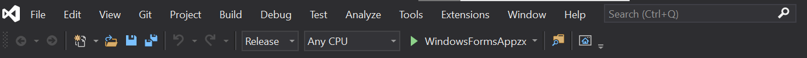
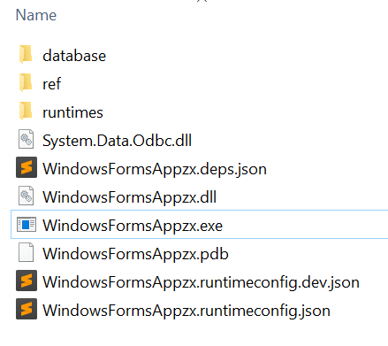

# sysapp 开发者说明文档

[toc]


## 项目架构

本项目是由.NET 5 winform框架开发，主要使用Visual Studio 2019作为IDE，项目文件如下图所示：


该文件夹内有众多文档，其中：

* bin目录存放编译后的exe文件（也就是应用程序）

* database目录为数据库，将该文件夹拷贝至C盘，并更名为sysappDatabase，如下图所示。


* Properties目录为ICON等资源文件。
* 下面.cs文件为程序代码，其中最核心的就是Program.cs

###  程序主要内容

分为三部分：

* 主界面及其相关逻辑代码分别为MainForm.Designer.cs和MainForm.cs 


* 答题界面及其相关逻辑代码分别为AnswerControl.Designer.cs和AnswerControl.cs


* 统计信息界面及其相关逻辑代码分别为AnswerControl.cs和AnswerControl.Designer.cs


### 逻辑代码框架

#### Main窗口

```c#
//-----------此段代码来自MainForm.cs------------
//...
        // 声明public control的对象。
        public StatControl stat;
        public AnswerControl Answer;

        private void ButStat_Click(object sender, EventArgs e)
        {
            // 这是用form形式的子窗口
            //StatForm Stform = new StatForm();
            //Stform.MdiParent = this;
            //Stform.Parent = this.MainPanel;
            //Stform.Show();
            stat = new StatControl();
            stat.Show();
            MainPanel.Controls.Clear();    //清空原容器上的控件
            MainPanel.Controls.Add(stat);    //将窗体三加入容器panel

        }

        private void ButAnswer_Click(object sender, EventArgs e)
        {
            Answer.Show();
            MainPanel.Controls.Clear();    //清空原容器上的控件
            MainPanel.Controls.Add(Answer);    //将窗体三加入容器panel
        }
```

函数ButStat_Click和ButAnswer_Click，是用来在主界面相关Button鼠标点击后初始化并显示对应界面的。

有这两个函数对比可以看出，我们很容易可以添加另外的界面，以UserControl (随便根据需要添加想要的界面)界面为例：

```c#
        public UserControl User;
		private void ButUser_Click(object sender, EventArgs e)
        {
			User = new UserControl();
            User.Show();
            MainPanel.Controls.Clear();  
            MainPanel.Controls.Add(User);  
        }
```


#### 答题代码实现

```c#
//本段代码节选自文件AnswerControl.cs

//下面两句代码是初始化数据库连接的核心代码，Dbq就存放数据路的绝对路径，所以这就是之前需要将数据库复制到C:\sysappDatabase的原因，当然，作为开发者可以根据需求改动此目录，只要能找到该数据库即可。
		static string strCon1 = @"Driver={Microsoft Access Driver (*.mdb, *.accdb)};Dbq=C:\sysappDatabase\Question.accdb;";
        private readonly OdbcConnection conn = new OdbcConnection(strCon1);

//下面这个函数就是将答题的问卷信息保存到数据库，添加其他题目就是大同小异了。
        private void AddInfoToData()
        {
            conn.Open();
            string columns = "姓名,性别,年龄,身高,体重,职业,学历";
            string strSql = $"insert into 人员信息表 ({columns}) values (?,?,?,?,?,?,?)";
            
            OdbcCommand inscmd = new OdbcCommand(strSql, this.conn);
            
            inscmd.Parameters.AddWithValue("姓名", this.BoxName.Text);
            inscmd.Parameters.AddWithValue("性别", this.BoxGender.Text);
            inscmd.Parameters.AddWithValue("年龄", this.BoxAge.Text);
            inscmd.Parameters.AddWithValue("身高", this.BoxHight.Text);
            inscmd.Parameters.AddWithValue("体重", this.BoxWight.Text);
            inscmd.Parameters.AddWithValue("职业", this.BoxCarrer.Text);
            inscmd.Parameters.AddWithValue("学历", this.BoxEdu.Text);
            inscmd.ExecuteNonQuery(); 

            conn.Close();
        }
```


#### 数据库编辑代码实现

```C#
//本段代码节选自StatControl.cs

//下面两句代码对比上文中，可以看出，如出一辙，这就是数据库连接的初始化代码
        // 初始化access database
        static readonly string strCon = @"Driver={Microsoft Access Driver (*.mdb, *.accdb)};Dbq=C:\sysappDatabase\Question.accdb;";
        private readonly OdbcConnection con = new OdbcConnection(strCon);
        private string CurrentTableName = "人员信息表";

//下面函数是用来显示数据库的，核心思路就是初始化一个adapter和command。将数据库与可视化代码中的DataTable对象绑定。
        private DataTable DataBinding(string tablename)
        {
            con.Open();
            string strSql = $"select * from {tablename}";
            OdbcDataAdapter dadapter = new OdbcDataAdapter();
            dadapter.SelectCommand = new OdbcCommand(strSql, con);
            DataTable table = new DataTable();
            dadapter.Fill(table);
            con.Close();
            dataGridView1.DataSource = table;
            return table;
        }
```


## 基本使用


### 编译运行



点击上图中的绿色箭头就可以实现编译，存放在bin/release/文件夹中，如下图所示：



若调试好，就可以将上图中文件全部拷贝到任意位置，这就是所谓的软件。而将exe文件创建快捷方式到桌面，就可以作为正常软件运行了。


## 开发参考

* [.NET 官方文档](https://docs.microsoft.com/zh-cn/dotnet/core/introduction)
* [Winform官方文档](https://docs.microsoft.com/zh-cn/dotnet/desktop/winforms/?view=netdesktop-5.0)
* [DataBinding官方文档](https://docs.microsoft.com/en-us/dotnet/desktop/winforms/controls/how-to-bind-the-windows-forms-datagrid-control-to-a-data-source?view=netframeworkdesktop-4.8&viewFallbackFrom=netdesktop-5.0)
* [DataBinding论坛StackOverflow](https://stackoverflow.com/questions/5384525/c-sharp-database-connection-and-datagridview)
* [ODBc库的使用](https://www.c-sharpcorner.com/article/executing-sql-queries-and-sql-stored-procedure-with-odbc/)