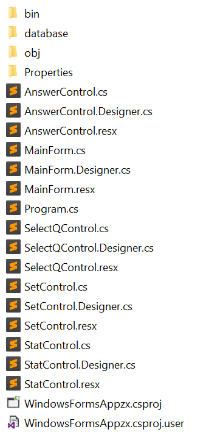
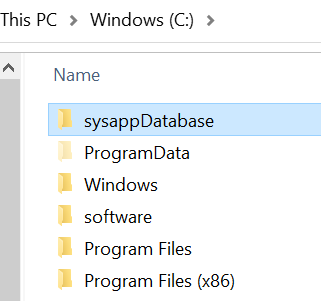
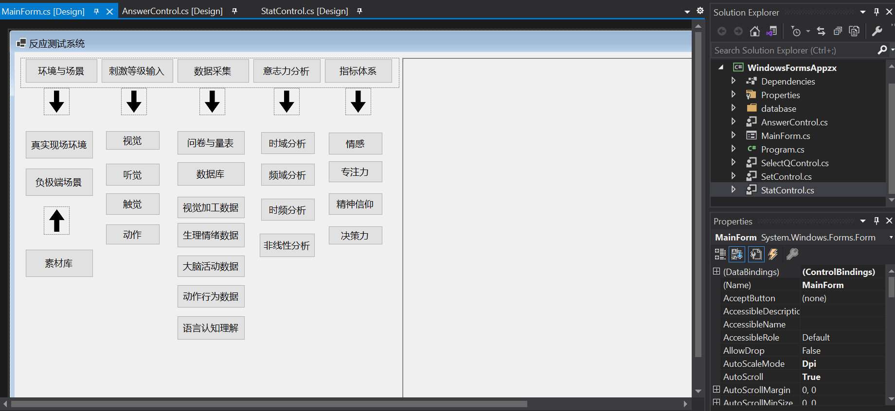
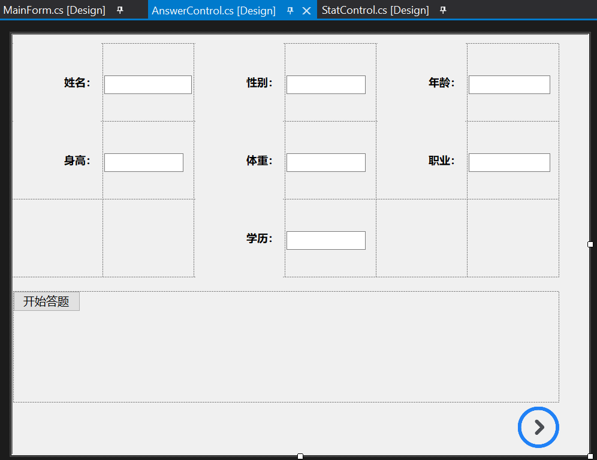
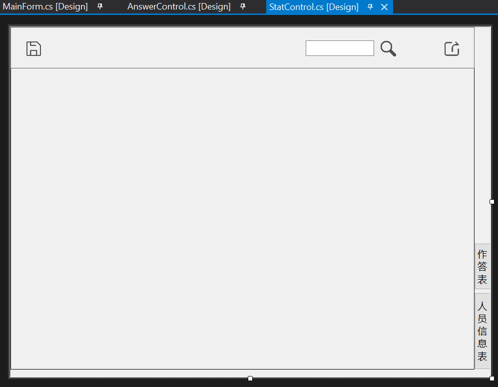

# sysapp 开发者说明文档

[toc]


## 项目架构

本项目是由.NET 5 winform框架开发，主要使用Visual Studio 2019作为IDE，项目文件如下图所示：



该文件夹内有众多文档，其中：

* bin目录存放编译后的exe文件（也就是应用程序）

* database目录为数据库，将该文件夹拷贝至C盘，并更名为sysappDatabase，如下图所示。



* Properties目录为ICON等资源文件。
* 下面.cs文件为程序代码，其中最核心的就是Program.cs

###  程序主要内容

分为三部分：

* 主界面及其相关逻辑代码分别为MainForm.Designer.cs和MainForm.cs 




* 答题界面及其相关逻辑代码分别为AnswerControl.Designer.cs和AnswerControl.cs




* 统计信息界面及其相关逻辑代码分别为AnswerControl.cs和AnswerControl.Designer.cs




### 逻辑代码框架

#### Main窗口

```c#
//-----------此段代码来自MainForm.cs------------
//...
        // 声明public control的对象。
        public StatControl stat;
        public AnswerControl Answer;

        private void ButStat_Click(object sender, EventArgs e)
        {
            // 这是用form形式的子窗口
            //StatForm Stform = new StatForm();
            //Stform.MdiParent = this;
            //Stform.Parent = this.MainPanel;
            //Stform.Show();
            stat = new StatControl();
            stat.Show();
            MainPanel.Controls.Clear();    //清空原容器上的控件
            MainPanel.Controls.Add(stat);    //将窗体三加入容器panel

        }

        private void ButAnswer_Click(object sender, EventArgs e)
        {
            Answer.Show();
            MainPanel.Controls.Clear();    //清空原容器上的控件
            MainPanel.Controls.Add(Answer);    //将窗体三加入容器panel
        }
```

函数ButStat_Click和ButAnswer_Click，是用来在主界面相关Button鼠标点击后初始化并显示对应界面的。

有这两个函数对比可以看出，我们很容易可以添加另外的界面：